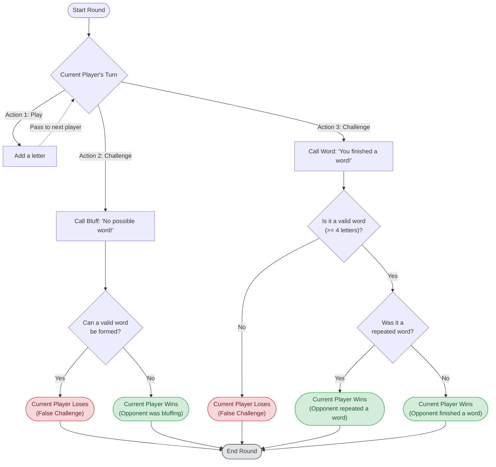

# Triebot : A word robot that almost never loses

A words game where players take turns adding letters to a growing word. The goal is to **avoid** being the one to complete a valid word, as that player loses. The game uses a trie data structure to efficiently check for valid words and prefixes.

### Rules
1. Words must be 4+ letters
2. No plurals ( apples, bananas etc)
3. No verb tense variants ( walking, walked, walks )
4. No names and brands ( Michael, Microsoft etc)
5. Can't repeat a word ( prevents infinite loops and boring strategies)
6. Bluff Call
	1. Repeated a word in the same game session
	2. Fragment cannot be a real word
	3.  If a word ain't in the app's dictionary, add it
7. Odd rounds so we can determine the winner

### Extras
1. Timed Rounds
2. Themed Rounds ( countries, animals, capitals etc) (PRO)
3. Tournaments (PRO)
4. Leaderboards (PRO)
5. Play with robot or X others (PRO)

### Tech Stack
1. React (NextJS with Typescript)
2. TailwindCSS
3. Zustand
4. PostgreSQL
5. Redis
6. Docker
7. SocketIO

## Game Logic & Flow

Players take turns adding letters to a growing word. The goal is to **avoid** being the one to complete a valid word, as that player loses. On each player's turn, they have 3 options:
1. Add a letter
2. Challenge the previous player (Bluff Call)
3. Challenge the previous player (Word Call)

If a player chooses to **Add a letter**, they append one character to the current fragment, and the play seamlessly passes to the next player. The fragment must still have the potential to form a real word.

If a player chooses the **Bluff Call**, they are challenging the previous player, claiming that the current fragment *cannot* possibly form a valid word. If the challenger is correct (no valid word can be formed), they win the round. However, if the previous player can state a valid word that starts with the current fragment, the challenger loses.

If a player chooses the **Word Call**, they are challenging the previous player, claiming that the current fragment *is already a complete, valid word* (of 4 or more letters). If the fragment is indeed a valid word, the challenger wins the round (because the previous player completed it). If the fragment is not a valid word, the challenger loses for making a false claim.

### Flowchart

